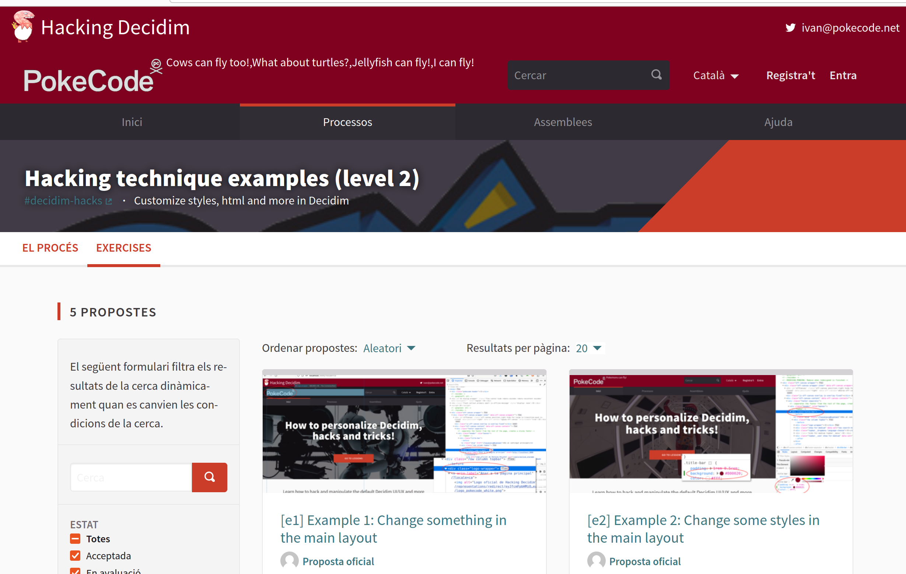
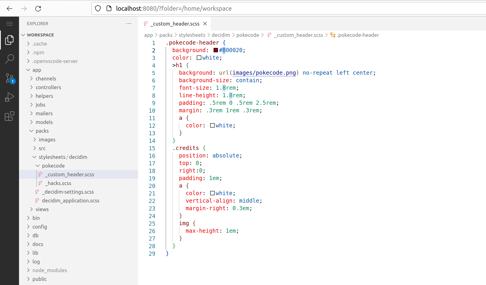

# decidim-hacks

Free Open-Source participatory democracy, citizen participation and open government for cities and organizations

This is the open-source repository for decidim-hacks, based on [Decidim](https://github.com/decidim/decidim).


## Setting up the application

This instance is intended to allow anyone interested to experiment with Decidim in a easy way by using Docker.

**This instance is for educational purposes and should not be used for production sites.**

> By cloning this repository, you only need Docker & Docker Compose to run the application and start experimenting with Decidim. You don't need to install Ruby, Rails, Postgres or any other dependency. 


### Requirements: 

1. Install **Docker** and **Docker-compose**, find the official guides to install them here:
    - [Windows 10](https://runnable.com/docker/install-docker-on-windows-10) and the [official](https://docs.docker.com/docker-for-windows/install/).

      We've also created a step-by-step guide to [install Docker on Windows Home Editions](docs/install-docker-on-windows-10-home.md). **Highly recommended if you are not familiar with docker.**

    - [Mac OS X](https://runnable.com/docker/install-docker-on-macos) and the [official](https://docs.docker.com/docker-for-mac/install/).

      If in doubt, check our step-by-step guide to [install Docker on Mac OS X](docs/install-docker-on-macos.md).

    - [Linux](https://docs.docker.com/install/linux/docker-ce/ubuntu/) (Ubuntu, find other OS in the same place). Also remember to install [docker-compose](https://docs.docker.com/compose/install/).

2. Clone this repository or [download and unpack it](https://github.com/openpoke/decidim-hacks/archive/master.zip) in some place.

```
git clone https://github.com/openpoke/decidim-hacks.git
```

### Running the application

Just open a terminal where you have cloned or downloaded this repository and execute:

```
docker-compose up
```

Depending on your case you might have to add `sudo` before the command. Is going to be a while the first time...

Point your browser to: http://localhost:3000

> **NOTE:** If you are using Windows and Docker Toolbox, `localhost` cannot be used to access a docker container. You can use the following command (while docker is up) to change it:
> ```
> docker-compose exec app bin/rails db:seed:hostname-windows-toolbox
> ```
> After that, you can use the address http://192.168.99.100:3000 instead.
> 
> Please read the complete guide to [install Docker on Windows Home Editions](docs/install-docker-on-windows-10-home.md) for further detail.

## Getting started

Every time you start the application, a set of exercises is created automatically, just follow the instructions in your browser. Look for the participatory processes "Level 1" and "Level 2" and, in there, open the "Exercises" component and follow the steps in order (recommended):



## The integrated VS Code editor

You can use the integrated VS Code editor to edit the files of the application. 

Use the following link to access it after you have started the application: http://localhost:8080/?folder=/home/workspace



## Hack something

You can open the file `app/views/layouts/decidim/_head_extra.html.erb` and change something in it, then refresh your browser.

## Troubleshooting

### Permissions problems

If you are forced to run Docker as root (ie: to use `sudo`), you might have to change the permissions of the files in your local repository in order to make it work. You can do it by running the following commands:

```bash
cd decidim-hacks
find . \( -type d -exec chmod 777 {} \; \) -o \( -type f -exec chmod 666 {} \; \)
chmod 777 entrypoint.sh bin/* node_modules/* -R
```

(Prefix `sudo` if needed)

### Full reset

To completely reset the environment, you can use the following commands:

```bash
docker-compose down --volumes
docker-compose up
```

(Prefix `sudo` if needed)

## Credits & Contributing

You are welcome to contribute by posting issues or PR.
 
Happy hacking!


Brought to you by [PokeCode](https://pokecode.net). 
