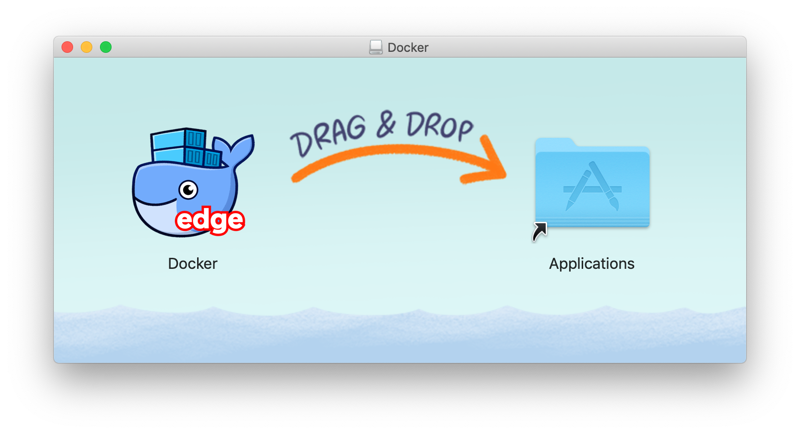
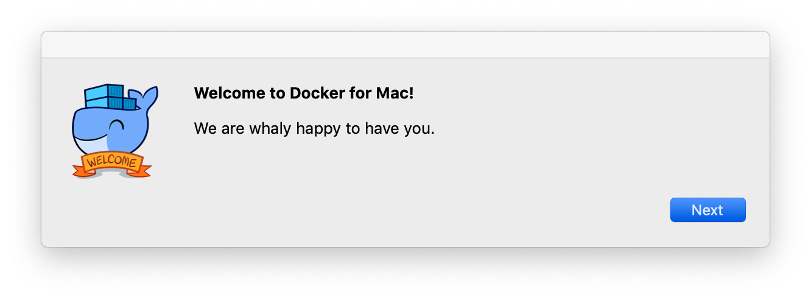
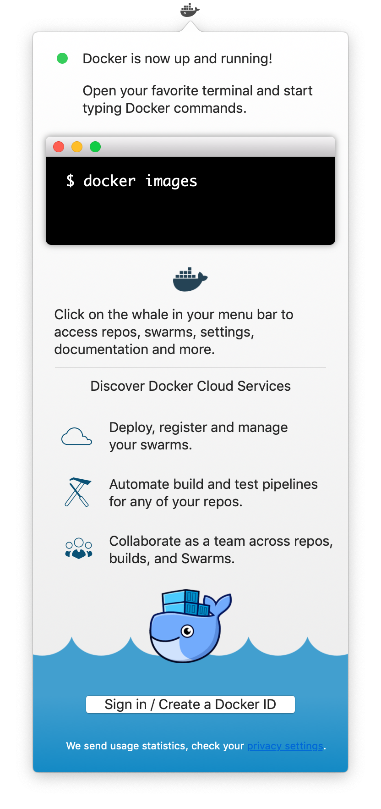
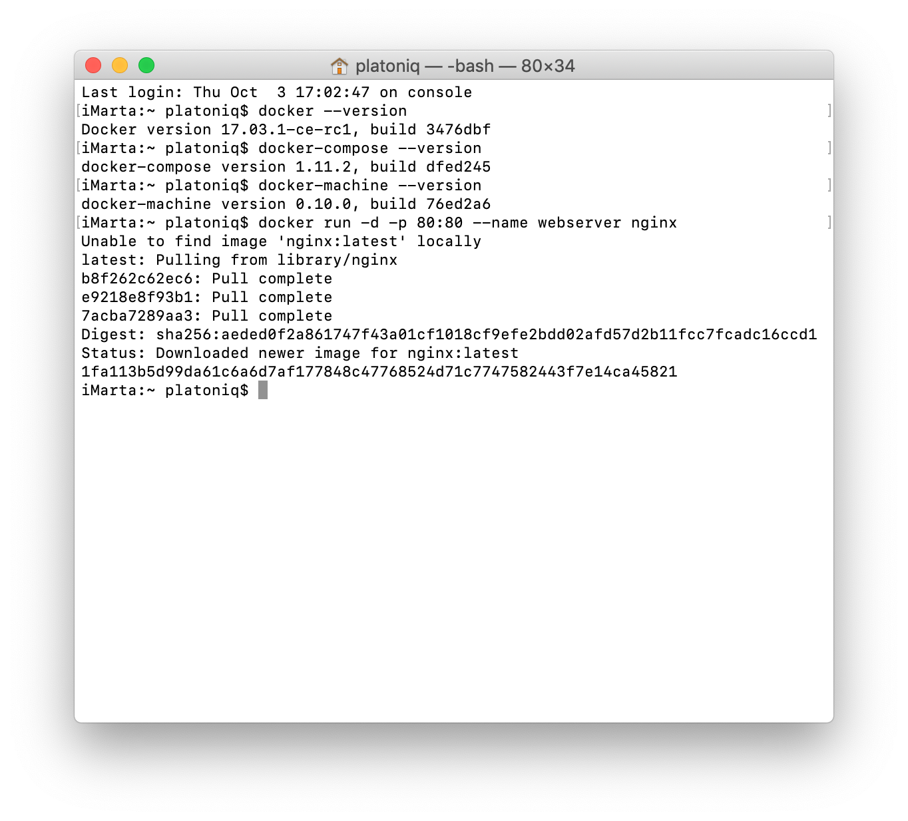
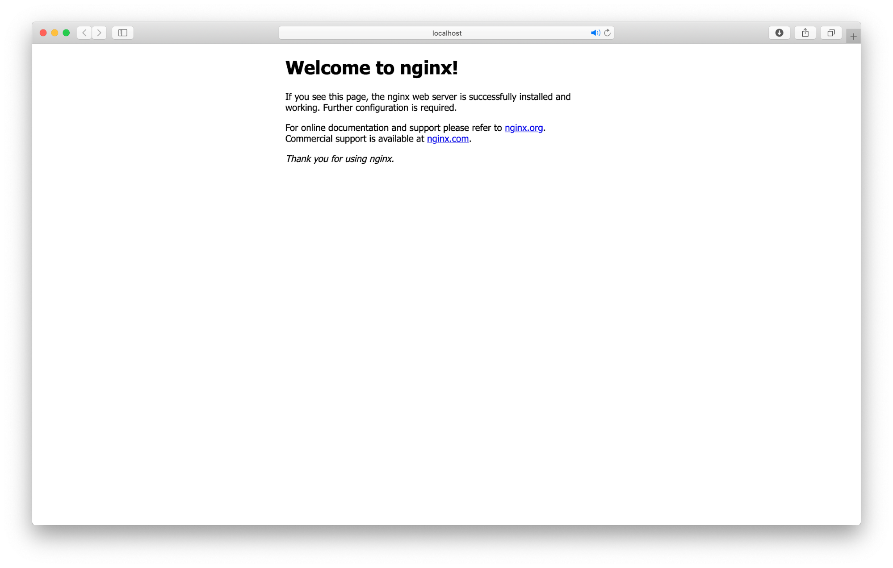
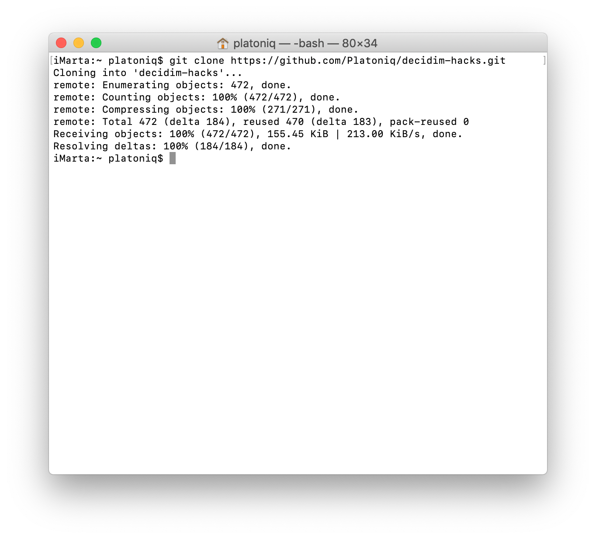
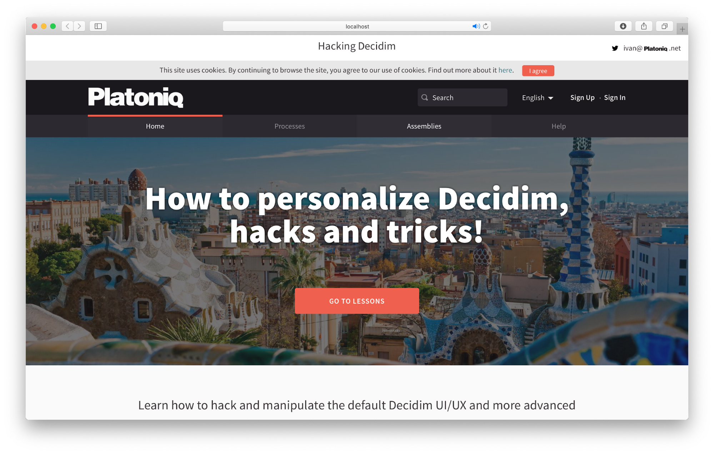

# Install Docker in Mac OS X, step by step

Installation, as long as you are up to date with the OS, should be quite straightforward, after downloading the `Docker.dmg` file, click on it and just follow the instructions:

## Step 1: Install Docker







## Step 2: Run some checks

You can check if everything is OK by running a simple container (this is optional, you can go directly to step 3 if everything went smoothly).

You can run the following commands and expect a result similar to the next image:

**Version checks:**
```
docker --version
docker-compose --version
docker-machine --version
```

**Test container**
```
docker run -d -p 80:80 --name webserver nginx
```



Check in your browser the address http://localhost/



**Stop test container**
```
docker stop webserver
```

## Step 3: Install Decidim Hacks

We will follow the instructions in the [README](../README.md) here, just download the repository `decidim-hacks` with this order:

```
git clone https://github.com/openpoke/decidim-hacks.git
```



**And then, go into business!**

```
docker-compose up
```

First time, the system may take a while, subsequent runs should significantly faster.


You're all set! just point your browser to http://localhost:3000/



To close the session, just use the combination `CONTROL + C` to stop `docker-compose`.

## Upgrades

Whenever there is an update in this repository, you can keep up by just executing this order before the `docker-compose up` command:

Download the updates:
```
git pull
```

Run again docker:
```
docker-compose up
```

If in trouble, try to rebuild the container:
```
docker-compose up --build
```

Happy hacking!


