# Install Docker Toolbox in Windows Home Edition, step by step

## Step 1: Try to install normal Docker

If you can install normal Docker as [is explained in here](https://runnable.com/docker/install-docker-on-windows-10), that's the best option. If everything goes well for you, hurrah! you can jump directly to Step 3.

Unfortunately, if you are using Windows Home or some other "minor" version is very likely that when clicking in the `InstallDocker.msi` will show you some message like this:

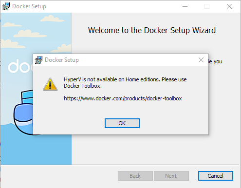

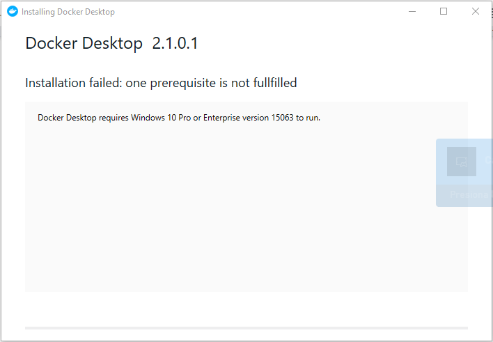

## Step 2: Install Docker Toolbox

This is only necessary if, for some reason, you are not able to run the normal Docker setup.

The official guide is here:
https://docs.docker.com/toolbox/toolbox_install_windows/

Basically, start by downloading the latest version here:
https://github.com/docker/toolbox/releases

Double click the file, and follow the usual "next", "next" windows, be good and say "yes" and trust everything:

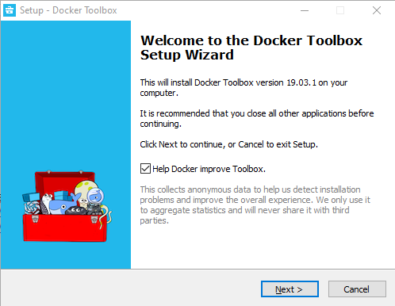

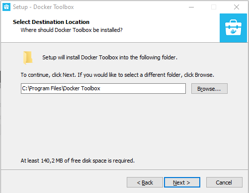

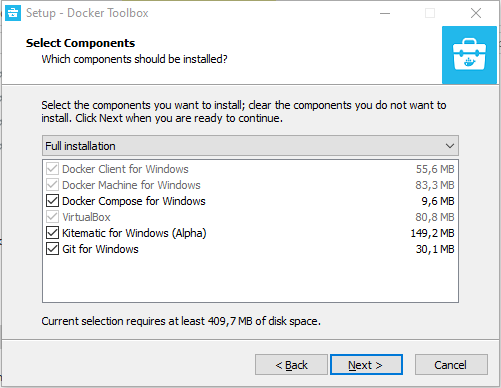

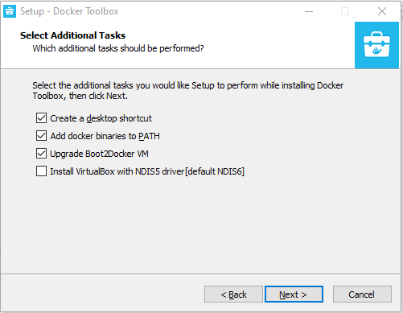

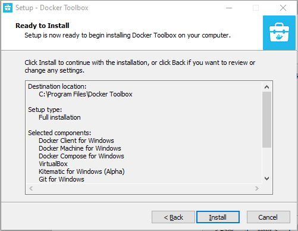

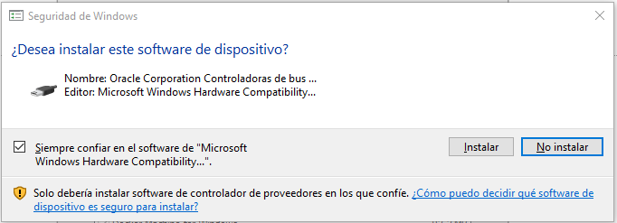

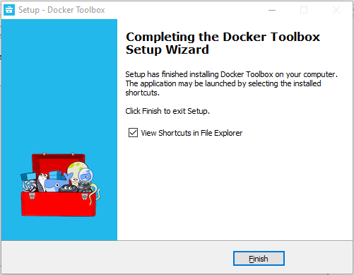

## Step 3: Run some checks

Highly recommended to not skip this part. We will find here the most common problem running Docker on windows:

Run the `Docker Quickstart Terminal`, if you see a complain about not having VT-X/AMD-v (virtual machine instructions) enabled in the BIOS. You will have to restart your computer, enter the BIOS menu and find that flag to enable it before continue.

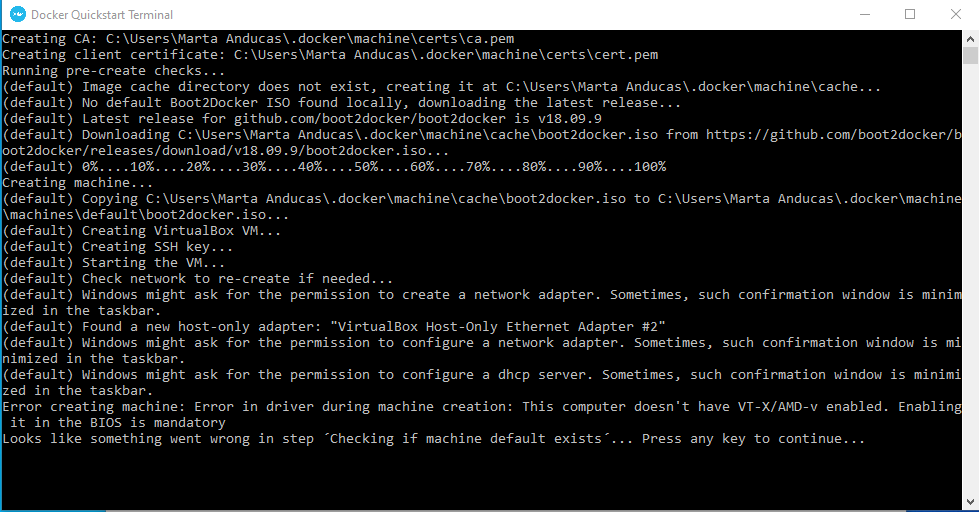

Having VT-X/AMD-v enable, you can run again `Docker Quickstart Terminal` and you should see something like this:

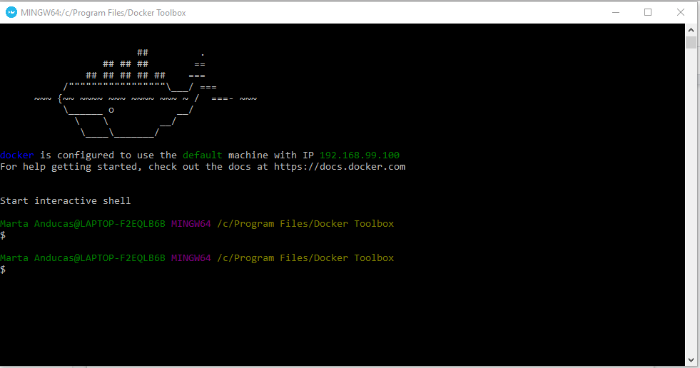

You can run a docker example to see if you can run docker properly:

```
docker run hello-world
```

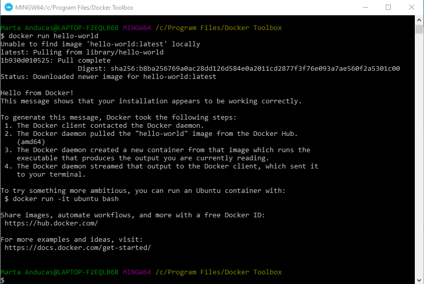

## Step 4: Configuring Git

Now, you have docker ready but we need to do a trick with GIT, the program that downloads the `decidim-hacks` repository. That's because in windows it tends to change the text files line endings when downloading. We don't want that because we need them intact in order for the system to work properly.

In the same Docker Terminal, execute the next 2 commands, this is only needed to do once. It is a global configuration flag:

```
git config --global core.eol lf
git config --global core.autocrlf input
```

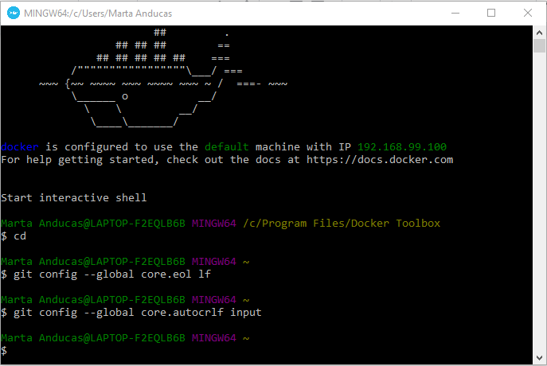

## Step 5: Install Decidim Hacks

We will follow the instructions in the [README](../README.md) here, just download the repository `decidim-hacks` with this order:

```
git clone https://github.com/openpoke/decidim-hacks.git
```

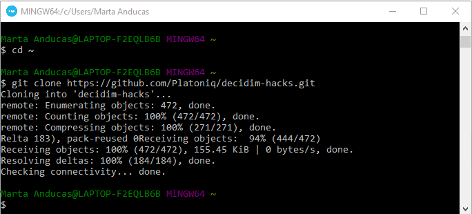


**And then, go into business!**

```
docker-compose up
```

First time, the system may take a while, subsequent runs should significantly faster.

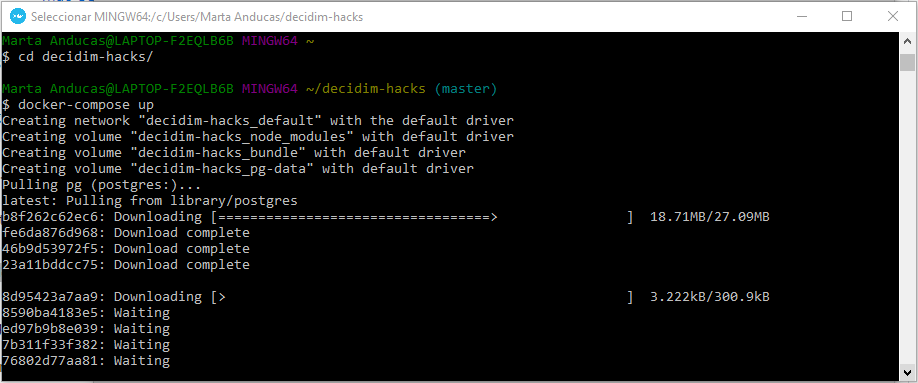

Now, as you've might noticed in the after running the terminal, it shows a message with the IP that access the Docker instance, this is important because we cannot use `localhost` when using Docker Toolbox. 

Normally this IP is  `192.168.99.100`, if your IP is different, please go to the appendix to change the host manually.

If your IP is `192.168.99.100`, you simply can open another terminal (while the other is running) and run this order there:

 ```
docker-compose exec app bin/rails db:seed:hostname-windows-toolbox
```
You can close this terminal after the command has finished.

This will set the default organization to use the address http://192.168.99.100:3000 instead of localhost.

Use your browser to see the page up and running now:


You're all set!

To close the session, just use the combination `CONTROL + C` to stop `docker-compose`.

> Something wrong? you can revert to the original address http://localhost:3000 with this command:
> 
> ```
> docker-compose exec app bin/rails db:seed:hostname-localhost
> ```

## Upgrades

Whenever there is an update in this repository, you can keep up by just executing this order before the `docker-compose up` command:

Download the updates:
```
git pull
```

Run again docker:
```
docker-compose up
```

If in trouble, try to rebuild the container:
```
docker-compose up --build
```

Happy hacking!

## APPENDIX: Manual configuring the system hostname.

You can edit the organization details in the system admin page. Go to http://192.168.99.100/system (or you Docker IP) and you will see a page like this:

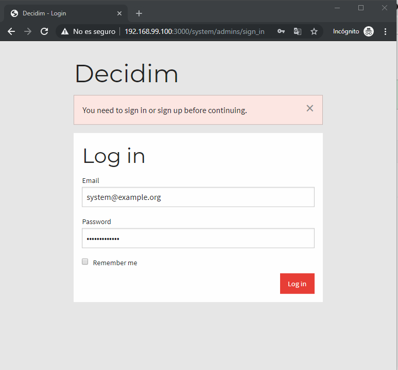

Enter with the user `system@example.org` and the password `decidim123456`:

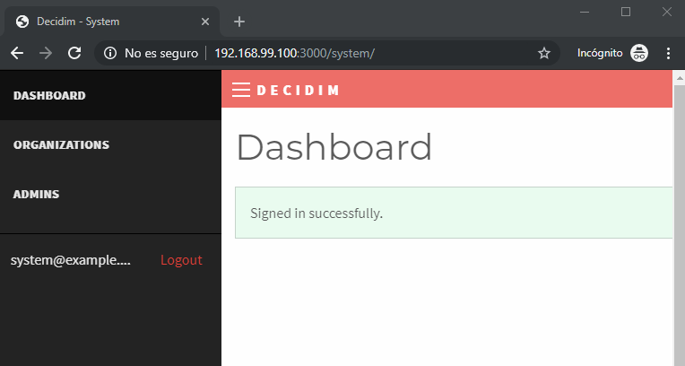

Go to organizations:

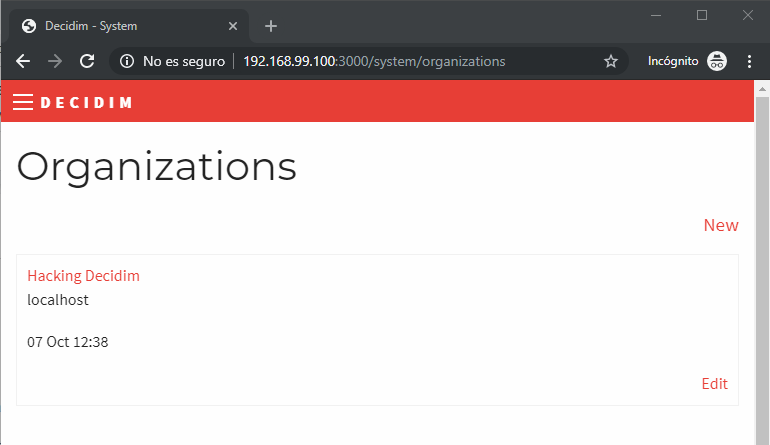

And edit the only one present, you will see a *Host* form input, just change it to use your IP:

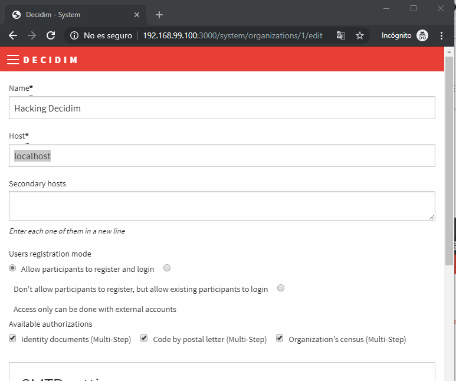

